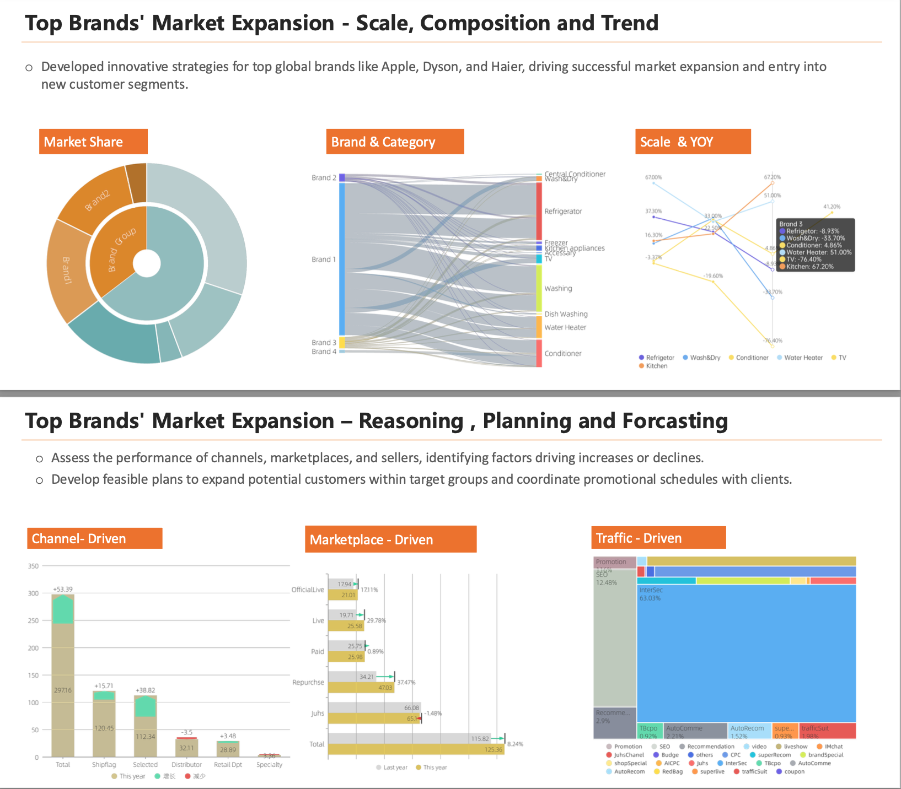
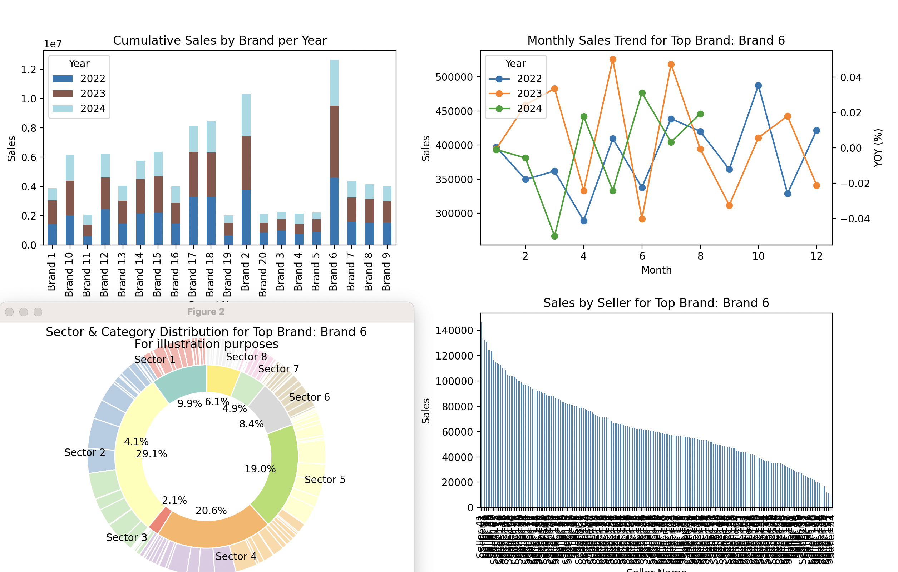
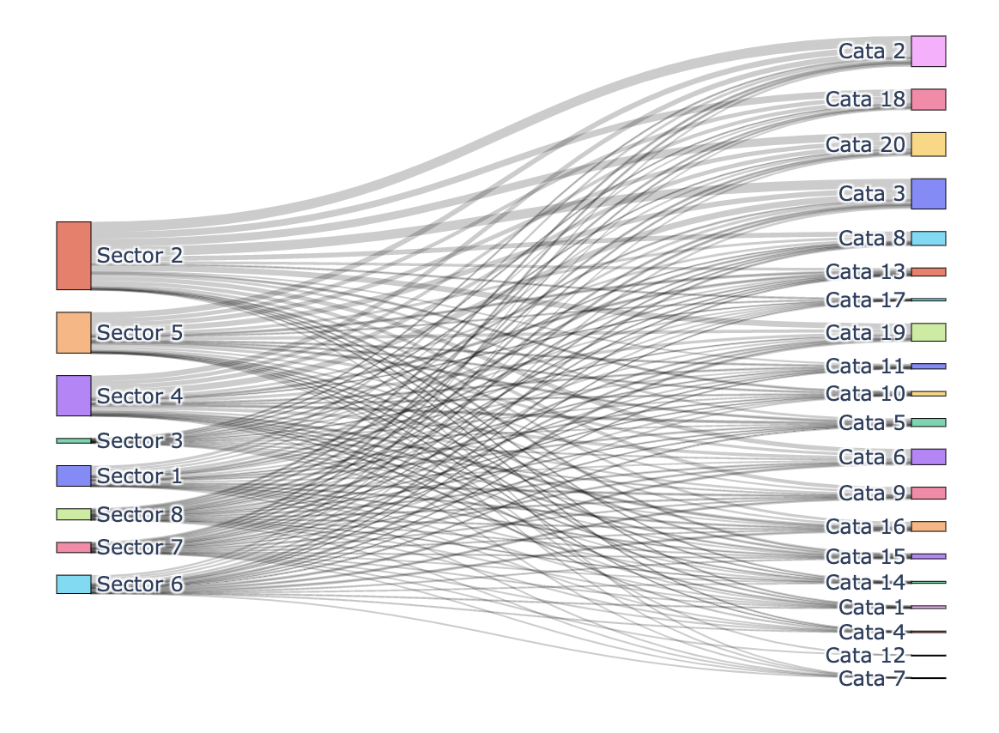

# XiangyuProjects


__DISCLAIMER__
- The data and scenarios presented in this project are entirely fictional and have been generated solely for demonstration purposes.
- All datasets used are mock data, created through scripts to illustrate specific data analysis methods and techniques. 
- None of the data structures, analysis methods, or results should be interpreted as reflective of actual data, operations, or assets of Alibaba or any other organization. 
- This project is not representative of any proprietary or confidential information from Alibaba or any real-world entity. 
- Any resemblance to real-world data is purely coincidental.


__Project Outline__


1. Top Brand Analysis

- Category Distribution: Evaluation of the product categories offered by leading brands, identifying high-performing segments.

- Merchant Analysis: Insights into key merchants, their performance, and competitive positioning within the platform.

- Strategic Recommendations: Data-driven suggestions for brands to optimize their product offerings and improve market share.


# Project Overview

## Project Dependencies
The project dependencies listed in `requirements.txt` are as follows:

```text
matplotlib==3.9.2
numpy==2.1.1
pandas==2.2.2
plotly==5.24.0
seaborn==0.13.2
```

## Project Directory Structure
The structure of the project is as follows:

```text
- ./
    - requirements.txt
    - BrandGlimpse.py
    - Brand.code-workspace
    - README.md
    - ODPSmocker/
        - MockRecordGenerator.py
        - dataMocker.py
        - readme_gnr.py
    - data/
        - product_data.csv
        - store_data.csv
        - user_data.csv
        - transaction_data.csv
```
